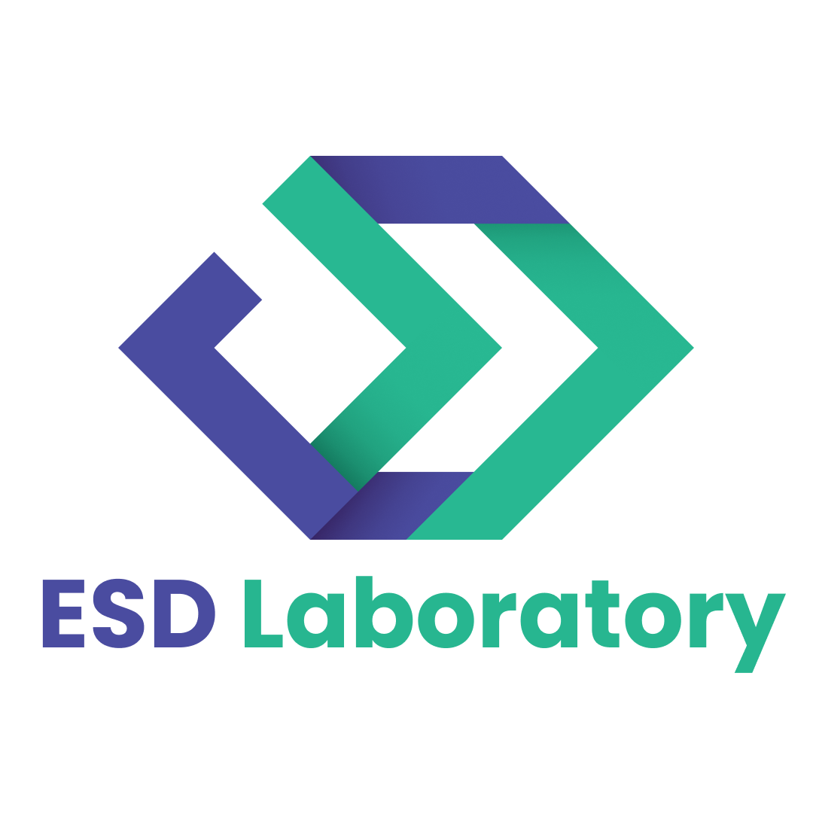

# ESD Laboratory

## Let's Know About ESD Laboratory
ESD Laboratory is Laboratory of School of Industrial Engineering, Telkom University. ESD Laboratory is a laboratory that focuses on the Software Development, UI/UX Design, and Technopreneurship. ESD Laboratory is a laboratory that is under the auspices of the Cybernetics Department, School of Industrial Engineering, Telkom University. ESD Laboratory is a laboratory that is under the auspices of the Cybernetics Department, School of Industrial Engineering, Telkom University.

This is offical github page of ESD Laboratory. You can see our project and our activity in this github page. You can also contribute to our project. If you want to contribute to our project, you can contact us via our social media.
- Instagram: [peopleatesd](https://www.instagram.com/peopleatesd/)

